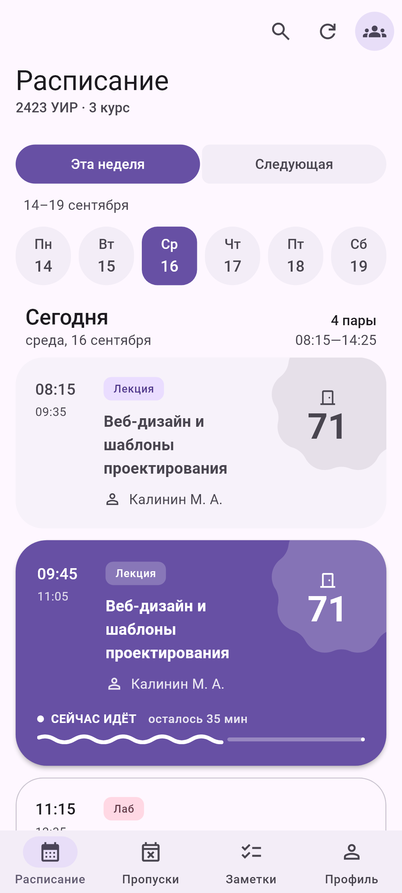
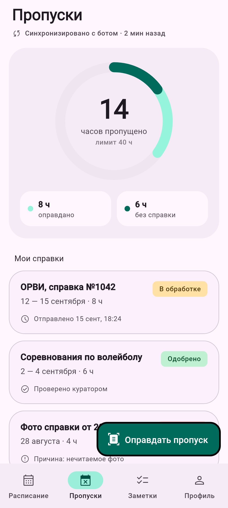
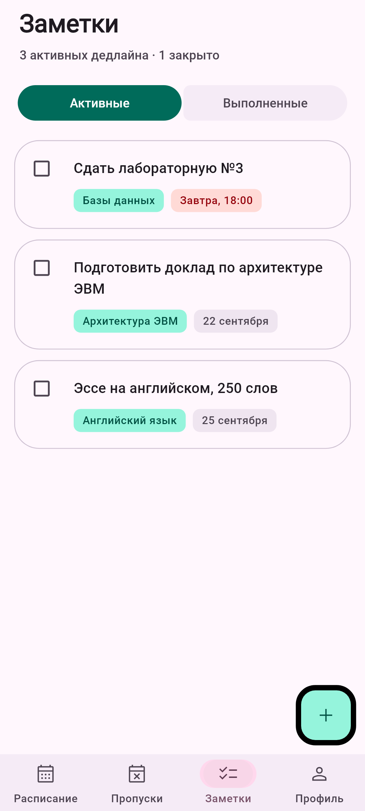
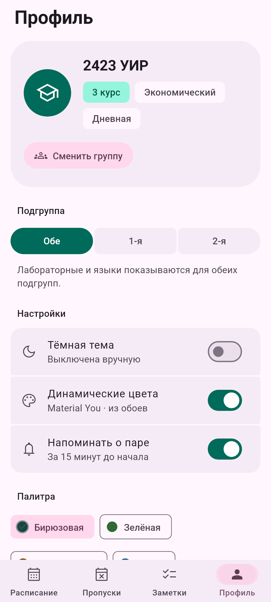
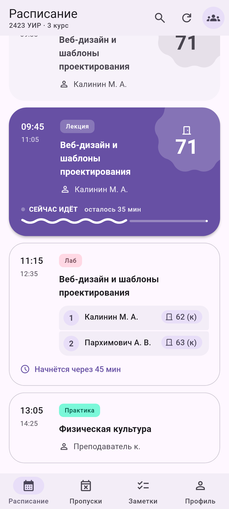
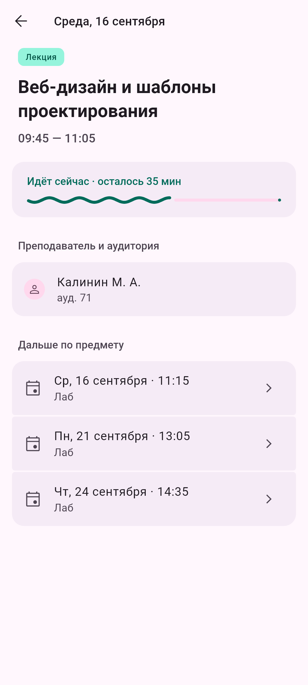

# Расписание — Material 3 Expressive

Android-приложение на Flutter: расписание студентов Международного университета
«МИТСО» с [apps.mitso.by](https://apps.mitso.by/). Интерфейс на русском, дизайн —
Material 3 Expressive строго по гайдлайнам Google.

- Правила работы с проектом — [`CLAUDE.md`](CLAUDE.md).
- Справочник по компонентам и стилям M3 — [`docs/m3/`](docs/m3/README.md).
- Исходный макет — `docs/Расписание - Material 3 Expressive.dc.html`.

---

## Запуск

### Android Studio

1. **File → Open** → папка `mitso_schedule`.
2. Дождаться `Pub get` (или `flutter pub get`).
3. Выбрать устройство и нажать **Run** (`Shift+F10`).

### Командная строка

```bash
flutter run                                   # на подключённом устройстве
flutter build apk --debug -t lib/main.dart    # -t обязателен, см. ниже
```

`minSdk 24`, `compileSdk 36`. Проверено на Pixel 7 (Android 17).

> **Если Google Maven недоступен.** Из некоторых сетей `dl.google.com` отдаёт 404, и первая
> сборка падает на `Plugin 'com.android.application' ... was not found`. Обход — зеркала Google
> Maven в глобальном init-скрипте Gradle (`~/.gradle/init.d/google-maven-mirror.gradle`), проект
> не меняется. Скрипт добавляет зеркала и в `pluginManagement`, и в
> `dependencyResolutionManagement`, возвращает `gradlePluginPortal()` и не трогает сборки с
> `FAIL_ON_PROJECT_REPOS`. В `gradle-wrapper.properties` задан `distributionSha256Sum`.

### Проверки

```bash
dart format lib test
flutter analyze        # без замечаний
flutter test           # 214 тестов
```

### Производительность

```bash
flutter test test/perf_probe.dart
```

Зонд считает перестройки виджетов и отрисовки за кадр в типовых сценариях: простой с идущей
парой, свайп и выбор дня, нажатия, прокрутка, смена вкладок, лист. Правила, которые он помог
найти:

- то, что меняется каждый кадр (волна прогресса, масштаб при fade through, высота pager'а,
  морфинг кнопки, рябь на карточке), — в своём слое (`RepaintBoundary`), иначе
  перерисовывается весь список;
- на кадре анимации перестраивается только анимируемое: `AnimatedBuilder` / `ListenableBuilder`
  получает готовое содержимое через `child`;
- `Material`, форму которого ведёт пружина, — с `animationDuration: Duration.zero`, иначе
  поверх пружины идёт ещё и неявный твин;
- страницы pager'а кэшируются, пока не поменялись дни; при программном перелистывании
  промежуточные страницы не выбираются.

**Плавность проверять на release-сборке.** Debug-сборка работает в JIT с проверками и на
телефоне заметно тормозит; `flutter build apk --release -t lib/main.dart` подписывается
debug-ключом и ставится поверх debug-версии.

### Скриншоты

```bash
flutter test test/screenshot_generator.dart
```

PNG всех вкладок в светлой и тёмной теме, субботы, листа регистрации пропуска с фото, пар
подгрупп, страницы подробностей и сохранённых справок — в `docs/screenshots/`. Фото справки
генератор рисует сам. Генератор подгружает Roboto и Material Symbols через
`FontLoader` и включает настоящие тени (`debugDisableShadows = false`).

| | |
|---|---|
|  |  |
|  |  |
|  |  |

### Проверки с сетью

Обычные тесты в сеть не ходят: сайт подменён сохранённой страницей 2423 УИР
(`test/fixtures`). С живым сайтом:

```bash
flutter test test/live/mitso_live_check.dart                  # на компьютере
flutter test integration_test/mitso_tls_test.dart -d <телефон>  # на Android
```

Второй тест проверяет, что без вложенных сертификатов соединение падает, а с ними расписание
загружается. Экран телефона должен быть разблокирован: Android 15+ закрывает сеть приложениям
не на переднем плане.

> **После integration-теста пересоберите приложение.** `flutter test integration_test/…`
> собирает `app-debug.apk` с тестом вместо `lib/main.dart`; такая сборка из лаунчера висит на
> сплэше. Перед установкой: `flutter build apk --debug -t lib/main.dart`.

---

## Источник данных: apps.mitso.by

Расписание открытое, вход не нужен.

- **Сайт на Yii2.** POST-запросы защищены CSRF-токеном сессии: сначала GET страницы формы
  даёт cookie и `<meta name="csrf-token">`.
- **Выбор группы** — цепочка Krajee DepDrop: `schedule/education` → `schedule/course` →
  `schedule/group`, ответы `{"output":[{"id","name"}]}`. Идентификаторы — транслит:
  ``E`konomicheskij``, `Dnevnaya`, `3 kurs`, `2423 UIR`.
- **Расписание** — один POST на `schedule/group-schedule` возвращает текущую и следующую неделю.
- **Разметка**: `div.weekly-schedule`, в нём `h2` «Понедельник, 14 сентября» и таблица.
  Пара — `Название(тип) Фамилия И. О.`, подгруппы — строки `1. …` / `2. …` в одно время.
- **Сертификат**: сервер отдаёт только `*.mitso.by` без промежуточного «GlobalSign GCC R46
  AlphaSSL CA 2025», Android его не докачивает. Промежуточный и корень лежат в `assets/certs`
  и добавляются к системным; проверка сертификата не отключается.
- `student.mitso.by` — лицевой счёт (вход по номеру счёта). Пропусков там нет.

## Пропуски

Пропуски и статусы справок будет присылать Telegram-бот; пока его API нет, статистики на
вкладке нет. Пропуск регистрируется фото справки: системная камера или фотовыбор Android
(`image_picker`, разрешение на камеру не нужно). Фото копируется в файлы приложения
(`path_provider`), список справок хранится в `shared_preferences` со статусом «Не отправлено».
Диаграмма сводки (`AbsenceDonut`) готова к данным бота: кольцо — все пропущенные часы, дуги —
доли по справке и без, лимита нет.

Расписание кэшируется: сохранённое показывается сразу, свежее подтягивается в фоне; если
обновление не удалось, снекбар предлагает повторить. Автоповторов нет. Строки подгрупп в одно
время — одна пара (`ScheduleDay.slots`); в профиле можно оставить только свою подгруппу.

---

## Material 3 Expressive

Каждый компонент сверен с тремя источниками — m3.material.io (текст гайдлайнов и таблицы токенов
выгружает `python tool/m3_guidelines.py`), исходниками Compose Material3 и MDC-Android. Разбор по
компонентам, расхождения и решения — в [`docs/m3/`](docs/m3/README.md).

Flutter 3.44 не поставляет Expressive-компоненты и `MotionScheme`, поэтому они портированы с
Compose:

| Что | Виджет | Образец Compose |
|---|---|---|
| Пружины `MotionScheme`, скорость при смене цели, уменьшение движения | `AppMotion`, `springTo`, `reduceMotionOf` | `MotionScheme.kt`, `ExpressiveMotionTokens.kt` |
| Кнопки, icon buttons, toggle buttons | `M3Button`, `M3IconButton`, `M3ToggleButton` | `Button.kt`, `IconButton.kt`, `ToggleButton.kt` |
| Группы кнопок (нажатая расширяется, соседи сжимаются) | `M3ButtonGroup`, `ConnectedButtonGroup`, `DaySelector` | `ButtonGroup.kt` |
| FAB, medium FAB, extended FAB, показ и скрытие | `M3Fab`, `M3ExtendedFab`, `M3AnimatedFabVisibility` | `FloatingActionButton.kt` |
| Переключатель с галочкой и крестиком | `M3Switch` | `Switch.kt` |
| Чекбокс, filter chip, plain tooltip | `M3Checkbox`, `M3FilterChip`, `M3PlainTooltip` | `Checkbox.kt`, `Chip.kt`, `Tooltip.kt` |
| Flexible navigation bar | `M3NavigationBar` | `ShortNavigationBar.kt`, `NavigationItem.kt` |
| Medium flexible и small app bar, доводка | `SliverMediumFlexibleAppBar`, `M3SmallAppBar`, `M3AppBarSettle` | `AppBar.kt` |
| Contained full-screen поиск: из строки и из кнопки-иконки | `M3SearchBar`, `showM3Search` | `SearchBar.kt`, MDC `SearchViewAnimationHelper` |
| Segmented list с морфингом формы | `SegmentedList`, `M3ListItem` | `ListItem.kt` |
| Модальный нижний лист на пружинах, predictive back | `showM3ModalBottomSheet` | `ModalBottomSheet.kt`, `BottomSheet.kt` |
| Loading indicator (indeterminate и determinate) | `M3LoadingIndicator` | `LoadingIndicator.kt` |
| Волнистый прогресс | `M3WavyLinearProgress` | `WavyProgressIndicator.kt` |
| Pull-to-refresh | `M3PullToRefresh` | `PullToRefresh.kt` |
| Снекбар | `M3SnackbarHost` | `SnackbarHost.kt` |
| Pager (lateral) | `ExpandablePageView`, `M3Pager` | `Pager.kt`, `PagerState.kt` |
| Динамические цвета Android 14+ | `SystemColorRoles` + `MainActivity.kt` | MDC `values-v34/tokens.xml` |

**Движение.** Смена раздела — fade through; смена дня и недели — lateral (страницы едут за
пальцем, без затухания); шаги выбора группы — shared axis X; подробности пары — платформенный
forward/backward с predictive back; поиск из кнопки выезжает снизу, как `SearchView` MDC. Какой токен пружины у какого свойства — как у аналогичного
компонента Compose.

---

## Сознательные отступления от спеки

Подробности каждого пункта — в разделе «Реализация во Flutter» файла компонента в `docs/m3/`.

1. **Палитры из макета выводятся вариантом `DynamicSchemeVariant.expressive`.** Гайдлайны вариант
   не предписывают; он поворачивает оттенок сида, поэтому палитры подписаны по итоговому цвету.
   По умолчанию — эталонная схема M3 `#6750A4`.
2. **Динамические цвета на Android 12–13** — схема tonal spot из акцента обоев: системных ролей
   там нет. На Android 14+ роли берутся из системы.
3. **Лента дней** — группа toggle-кнопок на неделю: в кнопке две строки (день недели и число),
   хотя кнопкам положена однострочная подпись. На 360dp неделя с воскресеньем даёт кнопки ~40dp.
   Неделю выбирает connected group «Эта неделя / Следующая» над лентой.
4. **Статусы справок** — дополнительные цвета (custom colors) из оттенков макета: гармонизация с
   primary и тона акцентных ролей; «Отклонено» — роли error.
5. **Шрифт — системный Roboto.** Emphasized-стили — по весам `TypeScaleTokens`; осей Roboto Flex
   нет, шрифт не скачивается.
6. **Заголовок раздела** (`SectionHeader`) — `titleSmall`, `onSurfaceVariant`: токена у M3 нет.
7. **Кольцевая диаграмма пропусков** — визуализация данных, не компонент M3; дуги tertiary и
   primary с зазором 4dp, как у кругового индикатора; без пропусков — кольцо secondaryContainer.
8. **Pull-to-refresh** подключается к прокрутке через `ScrollPhysics`: у Flutter нет nested
   scroll. Список должен быть `AlwaysScrollable` и не `Bouncing`.
9. **Волнистый прогресс** сам анимирует значение за 500 мс; без трека не рисует stop indicator.
10. **Нижний лист** — свой маршрут (Flutter-лист анимируется по времени, не пружиной); тень level1
    по токену; ручка из полного положения закрывает лист, как `BottomSheetImpl`.
11. **Открытый поиск** — поля 12dp по токену (Compose — 8dp).
12. **Пункт списка** — многострочность supporting по эвристике Compose (выше 30sp), цвета
    интерполируются в sRGB.
13. **Переключатель и чекбокс** — цвета при нажатии и наведении по токенам m3.material.io (Compose
    их не меняет); ручку переключателя можно тянуть; неопределённый чекбокс по нажатию становится
    отмеченным.
14. **Подсказка** скрывается через 1,5 с после отпускания; задержка long press — 500 мс Flutter.
15. **Группа кнопок** — без overflow-меню; при уменьшении движения нажатая кнопка не расширяется.
    Toggle S при нажатии — 8dp по токену (Compose — 6dp).
16. **App bar** доводится только внутри `M3AppBarSettle`; у пунктов навбара «Вкладка N из M» в
    озвучке, как у Flutter `NavigationBar`, без кольца фокуса.
17. **Снекбар** держится 4 с без учёта системной настройки «время на действие».
18. **Пакеты на `material_ui` не используются**: `dynamic_color` 1.x и `animations` 2.x, потому
    что 2.x / 3.x не компилируются с Flutter 3.44 и не видят тему `package:flutter/material.dart`.
19. **Вкладка «Пропуски» без статистики**: её будет присылать Telegram-бот. Справки пока
    только сохраняются в приложении.
20. **Тема меняется без анимации** (`themeAnimationDuration: Duration.zero`), как `MaterialTheme`
    в Compose: твин темы Flutter перестраивал бы всё приложение на каждом кадре.
21. **Пары — карточками, а не списком** (решение заказчика): гайд cards → Adaptive советует
    список на compact-экранах. Радиусы 28 / 32dp вместо 12dp; метки типа занятия — подписи на
    контейнерных ролях, не чипы; номер аудитории — `displaySmall` жирным в форме Cookie9Sided из
    угла карточки (гайд shape: абстрактные формы — для декора, не для текста).

---

## Структура

```
lib/
  main.dart, app.dart        запуск, тема, динамические цвета, экран загрузки
  theme/                     движение, переходы, цвет, типографика, формы, отступы, state layer
  data/                      модели, клиент и разбор apps.mitso.by, фото справок
  state/                     Riverpod-контроллеры
  features/                  boot, home, schedule (карточки пар, неделя, поиск), group_picker,
                             absences, notes, profile
  widgets/                   порты компонентов M3 Expressive (m3_*.dart), SegmentedList, …
tool/m3_guidelines.py        выгрузка гайдлайнов m3.material.io в .m3-guidelines/
docs/m3/                     справочник M3 по компонентам и стилям
test/                        тесты экранов, компонентов, разбора, контраста; генератор скриншотов
```
