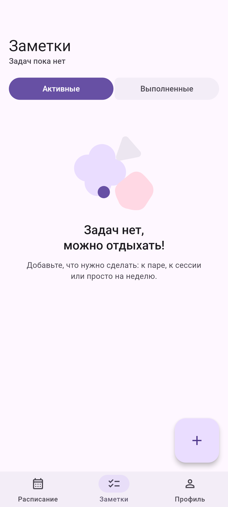
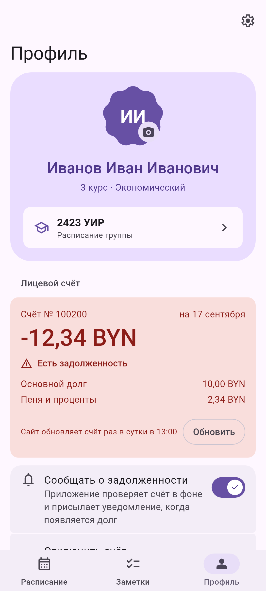
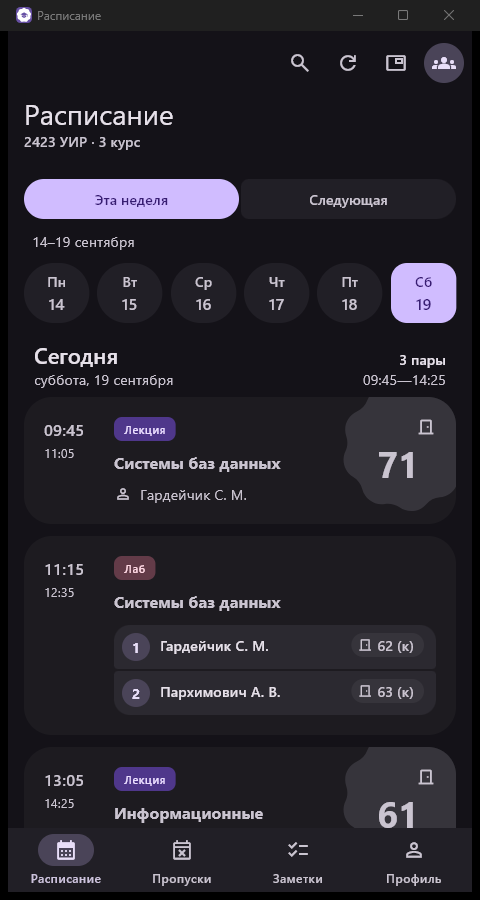
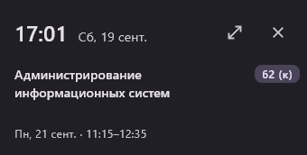

<div align="center">


# Расписание МИТСО

**Расписание занятий, напоминания о парах, заметки и лицевой счёт — на телефоне, компьютере и часах.**

*Приложение для студентов Международного университета «МИТСО».*

[](#-установка)
[](https://flutter.dev)
[](https://dart.dev)
[](https://m3.material.io)
[](https://z43-studios.vercel.app/)

</div>

---

## ✨ Возможности

**Расписание**
- Пары своей группы с [apps.mitso.by](https://apps.mitso.by/): текущая и следующая неделя, вход не нужен
- Преподавателям — своё расписание: выбрать себя в списке, и на карточках вместо фамилии будет группа
- Идущая пара видна сразу: волнистая шкала показывает, сколько осталось
- Подгруппы в одно время — одной карточкой, с преподавателем и аудиторией у каждой
- Поиск по предмету и преподавателю, обновление жестом сверху вниз
- Расписание сохраняется на устройстве и открывается без сети
- Напоминание перед началом пары: за 5, 10, 15, 30 минут, за час или за свой срок

**Учёба**
- Заметки: задача, предмет из расписания и срок; список разложен по срокам, выполненные уходят на отдельную вкладку

**Лицевой счёт** *(по желанию, только по номеру из договора)*
- Баланс в BYN, основной долг и пеня; при долге карточка становится красной
- Уведомление, когда долг появился или вырос
- Кнопка входа в СДО: пароль копируется в буфер, сайт открывается сам

**На компьютере**
- То же приложение под Windows, с установщиком без прав администратора
- Компактное окно: часы и ближайшая пара поверх других окон, с автозапуском

**На часах**
- Пары ближайшего дня на Wear OS и плитка «Ближайшая пара»
- Расписание приходит с телефона, часам не нужны ни сеть, ни вход

**Профиль**
- Фото профиля: снимок с камеры или из галереи, остаётся на устройстве
- Кто ты и чьё расписание открыто — в одной карточке, оттуда же смена группы

**Внешний вид**
- Material 3 Expressive: цвета из обоев Android, светлая и тёмная тема, пять запасных палитр
- Значок приложения на выбор, уважение к системной настройке «Удалить анимации»
- Приложение обновляет себя само — из подписанного релиза на GitHub

## 📱 Как выглядит

| | |
|---|---|
|  |  |
|  |  |

<div align="center">

**Windows** — то же приложение и компактное окно на рабочем столе




</div>

## 📦 Установка

Готовые сборки — на странице [Releases](https://github.com/OrionZ43/mitso_schedule/releases).

| Платформа | Требования | Что скачать |
|---|---|---|
| Android | Android 7.0 и новее | `arm64-v8a.apk`, а если не уверены — `universal.apk` |
| Windows | Windows 10 / 11, x64 | установщик `setup.exe` |
| Wear OS | Wear OS 3.0 и новее | `wear.apk` — ставится отдельно, см. ниже |

<details>
<summary><b>Android: разрешение на установку</b></summary>

<br>

Приложение ставится не из магазина, поэтому Android попросит разрешить установку для браузера или файлового менеджера, через который вы открыли APK. Разрешение можно выключить обратно сразу после установки. Дальше приложение обновляется само: проверяет релизы на GitHub и предлагает поставить новую версию.

</details>

<details>
<summary><b>Windows: предупреждение SmartScreen</b></summary>

<br>

Установщик пока не подписан сертификатом, поэтому при первом запуске Windows может показать окно «Система Windows защитила ваш компьютер». Нажмите «Подробнее» → «Выполнить в любом случае». Установка идёт в профиль пользователя и не требует прав администратора.

</details>

<details>
<summary><b>Wear OS: установка на часы</b></summary>

<br>

У часов вроде Pixel Watch нет разъёма для провода, а приложение-компаньон не умеет ставить APK, поэтому остаётся отладка по Wi-Fi. Часы и компьютер должны быть в одной сети.

1. На часах: **Настройки → Система → Об устройстве → Версии** → семь раз нажать «Номер сборки».
2. **Настройки → Для разработчиков → Отладка по Wi-Fi** → включить, открыть «Подключить новое устройство» и запомнить адрес, порт и код.
3. На компьютере:

```bash
adb pair <адрес>:<порт>          # спросит код с часов
adb connect <адрес>:<порт2>      # порт из строки «Отладка по Wi-Fi»
adb -s <адрес>:<порт2> install -r mitso-schedule-wear-<версия>.apk
```

Расписание приедет с телефона само, когда на нём откроется приложение. Плитка добавляется свайпом по циферблату: **+ → Расписание**.

</details>

## 🛠 Сборка из исходников

Понадобится [Flutter](https://docs.flutter.dev/get-started/install) (stable, проект собирается на 3.44). Для Android — Android SDK, для Windows — Visual Studio с компонентом «Разработка классических приложений на C++».

```bash
git clone https://github.com/OrionZ43/mitso_schedule.git
cd mitso_schedule
flutter pub get
flutter run
```

Релизные сборки:

```bash
flutter build apk --release -t lib/main.dart      # телефон (-t обязателен)
flutter build windows --release                   # компьютер
cd android && ./gradlew :wear:assembleRelease      # часы
```

Подробности — [`docs/development.md`](docs/development.md): проверки перед коммитом, зонд производительности, генераторы скриншотов и значков, устройство сетевого слоя, выпуск релиза с подписью обновлений.

## 🎨 Дизайн

Интерфейс собран строго по [Material 3 Expressive](https://m3.material.io): каждый компонент сверен с гайдлайнами, исходниками Compose Material3 и MDC-Android, а не нарисован на глаз. Flutter 3.44 Expressive-компонентов не поставляет, поэтому кнопки, группы кнопок, навигационная панель, app bar, поиск, листы, индикаторы и пружины движения портированы с Compose — это примерно две трети кода приложения.

Разбор по компонентам, токены и осознанные отступления от спецификации — в [`docs/m3/`](docs/m3/README.md).

## 🧩 Технологии

[Flutter](https://flutter.dev) · [Riverpod](https://riverpod.dev) · [material_new_shapes](https://pub.dev/packages/material_new_shapes) (формы M3) · [html](https://pub.dev/packages/html) (разбор страниц сайта) · [cryptography](https://pub.dev/packages/cryptography) (подпись обновлений) · Kotlin и [Compose for Wear OS](https://developer.android.com/training/wearables/compose) · [Inno Setup](https://jrsoftware.org/isinfo.php) (установщик для Windows)

## ⚖️ Дисклеймер

Независимый студенческий проект, не связанный с университетом «МИТСО». Расписание берётся с открытой страницы [apps.mitso.by](https://apps.mitso.by/) — так же, как его открыл бы браузер; массовых запросов и автоповторов приложение не делает.

Лицевой счёт подключается только по желанию и только по номеру, который вводит сам пользователь; номер, баланс и доступ к СДО хранятся на устройстве и стираются вместе с отключением счёта. Никакой аналитики и отправки данных на сторону в приложении нет.

---

<div align="center">

Сделано в **[Z43 Studios](https://z43-studios.vercel.app/)** · [Telegram](https://t.me/Orion_Z43)

</div>
